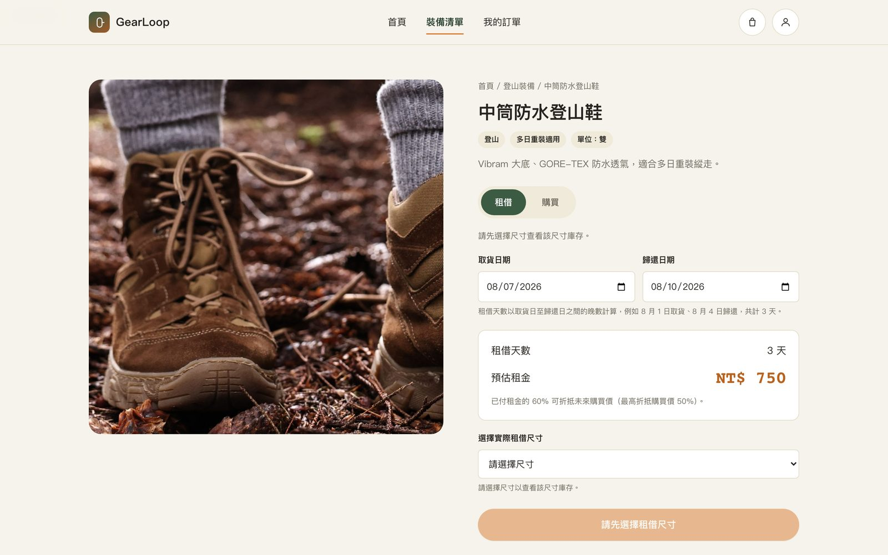

# GearLoop 戶外裝備租購平台

Live Demo: https://russell06-web.github.io/outdoor-gear-rental/
Case Study: https://russell06-web.github.io/projects/outdoor-gear-rental.html

## Overview

「先租後買」戶外裝備電商概念平台，讓使用者在買齊裝備前先租用實際商品試用，已付租金可折抵未來購買價，協助戶外新手安心踏出第一次戶外旅行。

## My Role

UI/UX Design、Information Architecture、Product Logic、UI Design、Front-End Implementation（個人專案，無 Figma 稿，直接從文字規格開發）

## Key UX Focus

- 尺寸／難度比對工具，取代堆疊的說明文字
- 租／買雙模式切換，同一商品頁承載兩種決策路徑，而非兩套獨立頁面
- 租轉買額度系統的即時試算與顯示
- 端對端購物流程（購物車→結帳→訂單→歸還驗收）的真實可運作性，而非靜態畫面
- 錯誤處理與資料可信度：HTML 注入防護、JS 例外復原畫面、示範資料清楚標示

## Features

- 13 項裝備品項，涵蓋登山／露營／水上活動三大分類
- 尺寸與難度比對工具（依裝備類型分別比對鞋號、身高、體重、容量）
- 租／買模式切換，價格與說明即時重新計算
- 租轉買額度系統（已付租金 60% 折抵，最高折抵買斷價 50%）
- 新手裝備套餐（Starter Kits）與最多 3 項商品比較
- 完整購物車、結帳、訂單狀態與歸還驗收流程（本機儲存，訂單狀態依日期自動推進）

## Validation

沒有真實使用者測試資源，驗證聚焦在端對端自動化測試：用 Playwright 涵蓋商品瀏覽、加入購物車、日期衝突處理、租／買模式切換、結帳驗證、額度兌換、訂單建立、會員中心渲染與歸還驗收共 9 種情境（A–I）。

## Limitations

個人概念作品，非真實商業產品。規格明確禁止新增功能與即時庫存同步，商品、庫存、訂單與會員資料皆為示範用途，沒有真人使用者測試或營運數據。

## Tech Stack

HTML、CSS、JavaScript（無框架）、Claude Code

## Screenshots

